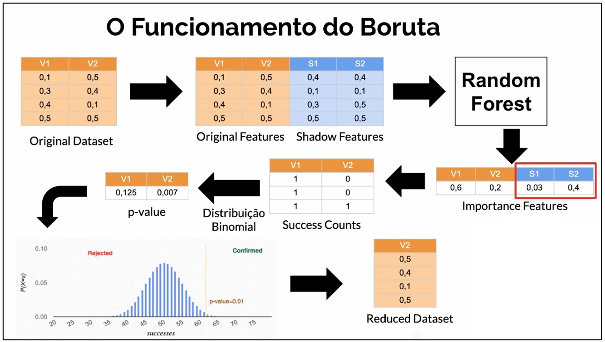
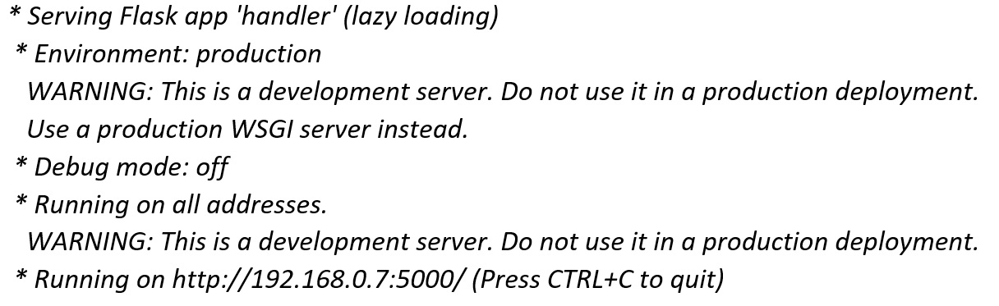
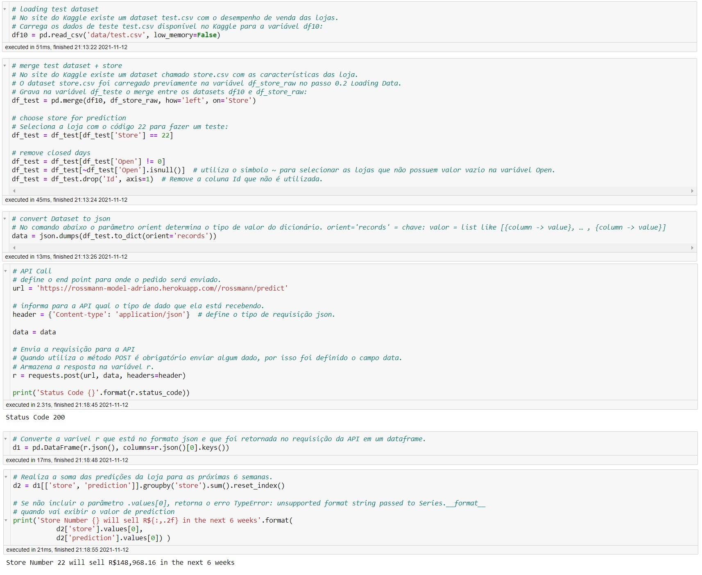
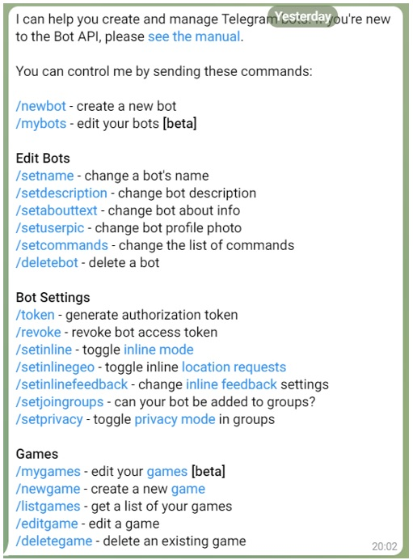
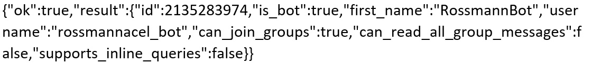

# Sales Forecast for Rossmann Stores (Time Series + Telegram Bot)

_This sales prediction project uses data from Rossmann, a Germany-based drug store chain with operations over more than 3,000 stores across seven European countries. The dataset is publicly available from a [Kaggle competition](https://www.kaggle.com/c/rossmann-store-sales/data)._

---
## 01. Brief Intro - Dirk Rossmann GmbH
A história da empresa começa em 1972, quando Dirk Roßmann abriu a primeira farmácia de autoatendimento na Alemanha. Hoje, a Dirk Rossmann GmbH, com 56.300 funcionários e 4.244 filiais, é uma das maiores redes de farmácias da Europa. Em 2020, o Grupo ROSSMANN gerou vendas de 10,35 bilhões de euros na Alemanha, Polônia, Hungria, República Tcheca, Albânia, Kosovo, Espanha e Turquia. Até hoje, Dirk Rossmann GmbH é um negócio familiar gerenciado pelo proprietário e internacionalmente ativo e é de propriedade majoritária da família Roßmann. Além disso, o Grupo A.S. Watson, globalmente ativo, tem uma participação de 40% na empresa.

---

## 02. Business Request
### a. The Business Situation
**Cenário**: “O CFO da empresa fez uma reunião com todos os gerentes de loja e pediu que cada um deles trouxesse uma previsão diária das próximas 6 semanas de vendas.
Depois da reunião, todos os gerentes entraram em contato, requisitando uma previsão de vendas de sua loja.”
### b. Questão de Negócio:
**Qual é o valor das vendas de cada loja nas próximas 6 semanas?**  

### c. Entendimento do Negócio:
- **Qual é a motivação?** A previsão de vendas foi requisitada pelo CFO em uma reunião mensal sobre os resultados das lojas.  
- **Qual é a causa raiz?** Dificuldade em determinar o valor do investimento para a reforma de cada loja.
- **Quem é o dono do problema?** Diretor Financeiro ( CFO ) da Rossmann.
- **Qual o formato da entrega?**
  -	**Granularidade**: Previsão de vendas por dia para cada loja para os próximos 42 dias / 6 semanas.
  -	**Tipo do Problema**: Previsão de Vendas.
  -	**Potenciais Métodos**: Séries Temporais.
  -	**Formato da Entrega**:
  	-	O valor total de vendas de cada loja no final da sexta semana.
    - Poder verificar as informações pelo celular.

---

## 03. Data Preparation
### a. O Objetivo da Descrição dos Dados
**“O quão desafiador é o problema que estou lidando”**. Precisamos saber a dimensão do problema que iremos enfrentar. Pode ser um problema que dure anos ou pode ser um problema que dure semanas.

### b. Qual a Quantidade de Dados?
**Servidores? Clusters? Spark? Hadoop?**
Eu tenho os recursos corretos para trabalhar?
Dependendo da quantidade de dados, o nosso computador pessoal não vai suportar e necessitaremos de servidores, cluster de servidores, linguagens preparadas para trabalhar com uma grande quantidade de dados, como por exemplo Spark e Hadoop.

### c. Tipos de Variáveis
**Quais são os tipos de variáveis? (% Numérica, % Categórica, % Temporal)**. Saber a porcentagem do tipo dos dados vai nos guiar à escolher as técnicas para trabalhar com os tipos de variáveis.

### d. Quantidade de Dados Faltantes
-	**Qual o volume de dados NA?**
  Necessitamos saber qual o volume de dados NA (não aplicável) ou vazio no conjunto de dados.
  Dependendo da quantidade de dados NA, podemos tomar duas decisões?
  
    -	Não fazer o projeto porque não temos dados suficiente.
    	
    -	Continuar com o projeto:
        -	Descartar as linhas que possuírem dados vazios.
  	         -	**Vantagem**: é rápido.
  	         -	**Desvantagem**: estamos jogando dado fora. As vezes descartas linhas não é uma boa estratégia, principalmente se temos poucos dados. As vezes apenas uma variável está NA, mas todas as outras variáveis estão completas e estas informações são muito importantes para o algoritmo aprender os padrões. Então, descartar as linhas pode prejudicar a performance do modelo.
        -	Preencher os dados vazios.
            -	Quando não temos informação de negócio: utilizando algoritmos de machine learning, utilizando mediana, media, etc...
            -	Entender o negócio: As vezes o NA está lá porque é uma lógica de negócio, foi definida por uma regra de negócio e soubermos a regra, podemos colocar valores nos NA´s e recuperar os dados.

### e. Resumo Geral dos Dados
A **Estatística Descritiva** nos fornece uma noção da grandeza dos dados, ter uma noção de limites mínimos e máximos das variáveis, mediana, estatísticas básicas para poder descrever os dados de uma maneira macro.

### f. Data Dimension
**Dados de treino**:
- Number of rows: 1017209
- Number of columns: 18

### g. Data Type
| Variable      | Data Type |
| ----------- | ----------- | 
|store|int64|
day_of_week|                       int64
date|                             object
sales|                             int64
customers|                         int64
open|                              int64
promo|                             int64
state_holiday|                    object
school_holiday|                    int64
store_type|                       object
assortment|                       object
competition_distance|            float64
competition_open_since_month|    float64
competition_open_since_year|     float64
promo2|                            int64
promo2_since_week|               float64
promo2_since_year|               float64
promo_interval|                   object

### h. Check NA
| Variable      | Qty |
| ----------- | ----------- | 
store|                                0
day_of_week|                          0
date|                                 0
sales|                                0
customers|                            0
open|                                 0
promo|                                0
state_holiday|                        0
school_holiday|                       0
store_type|                           0
assortment|                           0
competition_distance|              2642
competition_open_since_month|    323348
competition_open_since_year|     323348
promo2|                               0
promo2_since_week|               508031
promo2_since_year|               508031
promo_interval|                  508031

### i.	Fillout NA
-	**i. Competition Distance**: No site do Kagle [Rossmann Store Sales](https://www.kaggle.com/c/rossmann-store-sales/data) temos a seguinte definição para esta variável: _distance in meter to the nearest competitor store_.
Verifiquei que a distância em metros do competidor mais distante era de 75860. Eu assumi o valor **200000** para os valores faltantes.

-	**ii. Competition_open_since_month**: No site do Kagle [Rossmann Store Sales](https://www.kaggle.com/c/rossmann-store-sales/data) temos a seguinte definição para esta variável: _gives the approximate year and month of the time the nearest competitor was opened_. O valor pode estar vazio porque não possui competidor, ou porque não sabemos a data de abertura do concorrente. Pode ter sido aberta antes da inauguração da nossa loja ou abriu depois mas alguém esqueceu de anotar.
Eu assumi como premissa para os dados faltantes, o valor do mês da variável `date`.
Mantive este valor na variável, pois um competidor influencia no volume de vendas. Quando um competidor abre recentemente, o volume de vendas na nossa loja cai. Com o tempo, as vendas na nossa loja aumentam, porém não vão retornar ao patamar antes da inauguração do competidor.
Assumir o valor do mês do campo `date` pode não ter lógica, pois temos a influência do campo competition_distance.
Não era certeza que esta premissa iria funcionar. Por isso utilizei o método cíclico de gerenciamento de projeto chamado CRISP-DM (Cross Industry Standard Process for Data Mining). Na primeira iteração do CRISP-DM, utilizei esta premissa. Se o algoritmo não performasse bem, no próximo ciclo do CRISP-DM, poderia alterar esta premissa para esta feature.

-	**iii. Competition_open_since_year**: No site do Kagle [Rossmann Store Sales](https://www.kaggle.com/c/rossmann-store-sales/data) temos a seguinte definição para esta variável: _gives the approximate year and month of the time the nearest competitor was opened_. Eu assumi como premissa para os dados faltantes, o valor do ano da variável `date`. Foi utilizado o mesmo raciocínio descrito acima para a variável `Competition_open_since_month`.

-	**iv. promo2_since_week**: No site do Kagle [Rossmann Store Sales](https://www.kaggle.com/c/rossmann-store-sales/data) temos a seguinte definição para esta variável: _describes the year and calendar week when the store started participating in Promo2_. Eu substituí os valores faltantes pelo valor da semana da variável `date`.

-	**v. promo2_since_year**: No site do Kagle [Rossmann Store Sales](https://www.kaggle.com/c/rossmann-store-sales/data) temos a seguinte definição para esta variável: _describes the year and calendar week when the store started participating in Promo2_. Eu substituí os valores faltantes pelo valor do ano da variável `date`.

-	**vi. promo_interval**: No site do Kagle [Rossmann Store Sales](https://www.kaggle.com/c/rossmann-store-sales/data) temos a seguinte definição para esta variável: _describes the consecutive intervals Promo2 is started, naming the months the promotion is started anew. E.g. "Feb,May,Aug,Nov" means each round starts in February, May, August, November of any given year for that store_. Eu substituí os valores faltantes pelo valor 0.
    -	Foi criada a variável `month_map` com o valor do mês da variável `date`.
    - Foi criada a variável `is_promo` onde foram utilizadas as seguintes condições:
        - se o valor da variável `promo_interval` for igual à 0, atribui o valor 0 na variável `is_promo`, significando que a loja não está participando da promoção.
        - se o valor da variável `promo_interval` for diferente de 0, atribui o valor 1 na variável `is_promo`, se algum dos meses contidos no valor da variável `promo_interval` for igual ao valor do mês da variável `month_map`. Caso contrário, é atribuído o valor 0 na variável `is_promo`.

### j.	Change Type
-	Foram alterados os tipos das features `competition_open_since_month`, `competition_open_since_year` , `promo2_since_year` e `promo2_since_week` de float64 para int64.
-	Foi alterado o tipo da feature `date` de object para datetime64.

### k. Descriptive Statistics
-	**i. Numerical Attributes** 

`competition_distance` and `competition_open_since_year` are heavily skewed;

`customers`, `competition_distance`, `competition_open_since_year` have a high kurtosis, which indicates a profusion of outliers;
 
 
-	**ii. Categorical Attributes**

O gráfico acima exibe uma distribuição muito dispersa dos dados, pois a dimensão das variáveis está muito diferente.
Isto é muito provável de ocorrer, pois temos dias que são feriados, onde a loja está fechada e consequentemente a quantidade de vendas é zero.
Neste caso, a coluna 0 que representa dias sem feriados possui um volume de vendas bem maior que as outras três colunas a, b e c que são feriados: a = public holiday, b = Easter holiday, c = Christmas.
Desta maneira, criei dois boxplots separados, um para os dias normais e outro para os feriados.

O gráfico acima representa os dias que são feriados onde a loja estava aberta, isto é, com o valor da variável `sales` diferente de zero.

O gráfico acima representa os dias que não são feriados onde a loja estava aberta, isto é, com o valor da variável `sales` diferente de zero.
-	`state_holiday`, `store_type`, `assortment` have many outliers.

---

## 04. Feature Engineering
### a. O Mapa Mental de Hipóteses
A Análise Exploratória de Dados é um passo que pode ser tão complicado e tão detalhado quanto você queira.
A causa disso é que existem várias maneiras de fazer uma análise exploratória de dados e existem vários detalhamentos que podemos executar.

Podemos gastar muito tempo neste passo e temos que lembrar que estamos trabalhando em Ciclos de desenvolvimento e consequentemente, iremos executar novamente este passo. Então, não precisamos perder muito tempo neste passo, pois iremos detalhá-lo cada vez que executarmos um novo ciclo.

Para sabermos qual o mínimo de detalhamento que necessitamos ter, é necessário realizar um Mapa Mental de Hipóteses que é basicamente um roteiro que vai nos mostrar quais variáveis precisamos ter para fazer determinadas análises e validar as hipóteses.

O Mapa Mental de Hipóteses vai nos guiar na Análise Exploratória de Dados, possibilitando realizar este passo de forma muito mais rápida, mais direta e trazer Insights valiosos para aquele momento do ciclo do CRISP-DM.

-	**i. Fenômeno:**
Qual o fenômeno que estou modelando?
Aquilo que estou tentando medir ou modelar. Por exemplo: vendas, detecção de objetos em uma imagem, classificação da imagem entre gato e cachorro, Clusterização de clientes para criação de Personas, etc...
É o fenômeno que estamos modelando para ensinar os algoritmos de Machine Learning.

-	**ii. Agentes:**
Quem são os agentes que atuam sobre o fenômeno de interesse?
São todas as entidades que de alguma forma impactam no fenômeno.
Por exemplo: Você acha que os clientes impactam no fenômeno de vendas? A resposta é sim, pois se tivermos mais clientes, provavelmente teremos mais vendas. Lojas também são agentes, pois quanto mais lojas temos, mais iremos vender. Produto também é um agente, pois produto tem um preço que se subirmos o preço do produto venderemos menos e se diminuirmos venderemos mais.

-	**iii. Atributos do Agente:**
Qual é a descrição dos agentes?
Por exemplo: O cliente possui uma idade, escolaridade, estado civil, família, número de filhos, frequência que vai na loja, salário, profissão, etc ...

-	**iv. Lista de Hipóteses**.
O objetivo do Mapa Mental de Hipóteses é derivar uma lista de hipóteses e com esta lista iremos priorizar e fazer a análise para validar estas hipóteses.
Cada hipótese validada ou descartada é um Insight.
Um Insight é gerado através de duas formas:  
    -	**Através da surpresa**: Exemplo: Descobrimos que vendemos mais aos Sábados e ninguém sabia desta informação.
    -	**Contrapor uma crença**: Exemplo: o CFO diz ter certeza que acontecem mais vendas no final do ano. Durante a exploração dos dados é verificado que se vende menos no final do ano e isto choca a crença do CFO que esperava outra informação e ele gosta deste Insight que realizamos.
        
       Todas as informações que recebemos dos times de negócio que podem influenciar nas vendas, iremos utilizá-las para criar o Mapa Mental de Hipóteses e as suas respectivas afirmações de Hipóteses. Iremos anotar todos os agentes e perguntar para as pessoas quais são os atributos de cada agente.
       Hipóteses são APOSTAS. É o que você acha sobre alguma coisa:
    -	Lojas de MAIOR Porte deveriam Vender MAIS.
    -	Lojas com MAIOR Sortimento deveriam Vender MAIS.
    -	Lojas com MAIS Competidores deveriam Vender MENOS.
    
       É importante deixar claro dois pontos para as pessoas envolvidas:
    -	**Primeiro**: Deixar claro que estas informações de Hipótese são apostas, portanto iremos precisar primeiro dos dados para validar se uma Hipótese é correta ou não.
    -	**Segundo**: A Hipótese não é uma relação de causa e efeito, é apenas uma correlação. Não podemos afirmar que lojas de maior porte deveriam vender mais e então, aumentamos o tamanho de todas as lojas. Isto não é verdade porque o fenômeno de vendas, sofre o impacto de todas as outras entidades ao mesmo tempo. Utilizamos cada atributo do nosso conjunto de dados e relacionamos eles com a nossa variável resposta que no nosso caso são as vendas.

       Não podemos afirmar que lojas de maior porte deveriam vender mais e então, aumentamos o tamanho de todas as lojas. Isto não é verdade porque o fenômeno de vendas, sofre o impacto de todas as outras entidades ao mesmo tempo.
       Utilizamos cada atributo do nosso conjunto de dados e relacionamos eles com a nossa variável resposta que no nosso caso são as vendas.
       Estamos procurando com as hipóteses saber todos os pequenos efeitos que contribuem para aumentar ou diminuir a venda e desta maneira, poder ensinar o algoritmo de Machine Learning à aprender estes padrões.

#### **Hipóteses das Lojas**
1. Lojas com número maior de funcionários deveriam vender mais.
2. Lojas com maior capacidade de estoque deveriam vender mais.
3. Lojas com maior porte deveriam vender mais.
4. Lojas com maior sortimento deveriam vender mais.
5. Lojas com competidores mais próximos deveriam vender menos.
6. Lojas com competidores à mais tempo deveriam vender mais.

#### **Hipóteses dos Produtos**
1. Lojas que investem mais em Marketing deveriam vender mais.
2. Lojas com maior exposição de produto deveriam vender mais.
3. Lojas com produtos com preço menor deveriam vender mais.
4. Lojas com promoções mais agressivas (descontos maiores), deveriam vender mais.
5. Lojas com promoções ativas por mais tempo deveriam vender mais.
6. Lojas com mais dias de promoção deveriam vender mais.
7. Lojas com mais promoções consecutivas deveriam vender mais.

#### **Hipóteses de Tempo**
1. Lojas abertas durante o feriado de Natal deveriam vender mais.
2. Lojas deveriam vender mais ao longo dos anos.
3. Lojas deveriam vender mais no segundo semestre do ano.
4. Lojas deveriam vender mais depois do dia 10 de cada mês.
5. Lojas deveriam vender menos aos finais de semana.
6. Lojas deveriam vender menos durante os feriados escolares.

#### **Lista Final de Hipóteses**
Temos que verificar se possuímos ou não o dado disponível no momento da análise. Temos várias Hipóteses e podemos provar algumas com os dados que já possuímos.
Existirão Hipóteses que não possuímos os dados para validar. Então teremos que gastar um tempo para coletar estes dados e prepará-los. 
Validamos as hipóteses que possuem os seus respectivos dados. Após isto, se o modelo de ML estiver performando mal e verificarmos que outras variáveis sejam relevantes, então iremos coletá-las e utilizá-las na análise.

A lista final de Hipóteses abaixo considera as hipóteses criadas no item anterior que possuíam dados no conjunto de dados:
1. Lojas com maior sortimento deveriam vender mais.
2. Lojas com competidores mais próximos deveriam vender menos.
3. Lojas com competidores à mais tempo deveriam vender mais.
4. Lojas com promoções ativas por mais tempo deveriam vender mais.
5. Lojas com mais promoções consecutivas deveriam vender mais.
6. Lojas abertas durante o feriado de Natal deveriam vender mais.
7. Lojas deveriam vender mais ao longo dos anos.
8. Lojas deveriam vender mais no segundo semestre do ano.
9. Lojas deveriam vender mais depois do dia 10 de cada mês.
10. Lojas deveriam vender menos aos finais de semana.
11. Lojas deveriam vender menos durante os feriados escolares.

### b. Feature Enginnering
Foram criadas as seguintes variáveis:
-	`year` contendo o ano da variável `date`.
-	`month` contendo o mês da variável `date`.
-	`day` contendo o dia da variável `date`.
-	`week_of_year` contendo a semana do ano da variável `date`.
-	`year_week` contendo o número do ano e o número da semana da variável `date`.
-	`competition_since` contendo a informação do ano da variável `competition_open_since_year`, o valor do mês da variável `competition_open_since_month` e o valor do dia igual à 1.
-	`competition_time_month` contendo o valor em meses de quanto tempo existe um competidor. Este valor é a diferença da data da variável `date` com o valor da data da variável `competition_since`, dividindo o resultado por 30 para obter a quantidade de meses.
-	`promo_since` contendo o valor da variável `promo2_since_year` e `promo2_since_week`, onde ambos os valores são convertidos para string e entre estes valores é acrescentado o caractere "-". Por fim, esta variável é convertida para o formato de data.
-	`promo_time_week` contendo o valor em semanas de quanto tempo existe uma promoção. Este valor é a diferença da data da variável `date` com o valor da data da variável `promo_since`, dividindo o resultado por 7 para obter a quantidade de semanas.

Foram alterados os valores da feature `assortment` conforme descrito abaixo:
-	de **a** para **basic**.
-	de **b** para **extra**.
-	de **c** para **extended**.

Foi alterado os valores da feature `state_holiday` conforme descrito abaixo:
-	de **a** para **public_holiday**.
-	de **b** para **easter_holiday**.
-	de **c** para **christimas**.

### c. Filtrando Variáveis
-	**i. Restrições de Negócio**: As vezes começamos a fazer um projeto de ciência de dados e descobrimos no final do projeto que não conseguimos colocar o modelo em produção. E uma das maiores causas é que não consideramos as restrições de negócio no início do projeto. Uma solução para isto não ocorrer é considerar as restrições de negócio no início do projeto.

-	**ii.	Variáveis mais relevantes para o Modelo**: Está relacionado às variáveis mais relevantes para o modelo. O algoritmo vai verificar as correlações entre as variáveis e vai decidir quais variáveis são relevantes para o modelo. Porém, o algoritmo não leva em consideração as restrições de negócio. É papel do cientista verificar quais são as restrições que os times de negócio possuem para prover os dados que serão utilizados no modelo de Machine Learning.

Foram removidos os dados referentes à lojas fechadas e as lojas sem vendas, já que são irrelevantes para o objetivo de predição de vendas. Para isto, foram mantidas apenas as linhas que continham o valor da variável `open` diferente de 0, e o valor da variável `sales` maior do que 0.

Foi removida a variável `open` já que uma vez que selecionamos no passo anterior apenas as linhas da variável `open` que possuem valor diferente de 0, isto é, valor igual à 1, não teremos variabilidade de valor nesta variável, pois todos os valores são iguais à 1. Portanto, podemos excluir a variável `open`.

Foi removida a variável `customer` pois não temos disponível a informação de quantos clientes teremos nas lojas daqui à seis semanas. Teríamos que fazer um projeto separado para prever quantos clientes estariam nas lojas daqui à seis semanas, pegar este resultado e utilizá-lo como entrada neste projeto. Porém, não iremos fazer isto neste primeiro ciclo do projeto. Portanto, a variável `customer` é uma variável que não temos disponível no momento da predição, significando que é uma restrição de negócio.

Foi removida a variável `promo_interval` que foi utilizada para derivar a variável `is_promo`.

Foi removida a variável `month_map` que foi utilizada como uma variável auxiliar para a criação de outras variáveis.

---

## 05. Análise Exploratória de Dados
### a. O Objetivo da Análise Exploratória de Dados
**“Como as variáveis impactam o fenômeno?”**
e
**“Qual é a força desse impacto?”**.
A Análise Exploratória de Dados serve para medir o impacto das variáveis em relação à variável resposta e em muitas vezes, tentar quantificar este impacto.
A análise exploratória de dados nos fornece uma noção de como os dados se comportam e quais variáveis impactam o fenômeno que estamos prevendo, nos ajudando a selecionar as variáveis que serão utilizadas no modelo de Machine Learning, aumentando a assertividade do projeto.

### b. Quais são os objetivos da Análise Exploratória de Dados?
-	**i. Ganhar Experiência de Negócio**
Entender como o negócio funciona, o comportamento que o negócio possui através dos dados. O time de negócio já possui esta habilidade, pois ele está inserido na operação. Todo dia o time de negócio está discutindo KPI, métricas, medidas, etc...
Você como cientista de dados não possui este conhecimento pois fica em um time fora da operação.
Então, a AED é uma oportunidade de ganhar experiência para debater com o time de negócio, trocar ideias e trocas Insights.

-	**ii.	Validar Hipóteses de Negócio (Insights)**
Validar as hipóteses de negócio criadas no Mind Mapping de Hipóteses e com isto, gerar Insights.
Para gerar Insights necessitamos de duas coisas:
    -	**Gerar surpresa**: Fornecer uma informação que as pessoas não conheciam. 
    -	**Chocar uma crença de uma pessoa**: O time de negócios já possui muitos Insights de como a empresa funciona e consequentemente possuem muitas crenças. 
Exemplo: as pessoas do time de negócio sabem que no fim de semana vende mais, que no feriado vende menos, que determinado tipo de loja vende mais, etc...
São todas informações empíricas, pois provavelmente o time de negócio não parou para analisar os dados.
Se você apresenta para o time de negócio uma informação que contradiz uma crença, por exemplo: o time de negócio tem uma crença que um determinado tipo de loja vende mais, porém a análise dos dados mostra que este determinado tipo de loja vende menos,  e você apresenta isto, você está chocando uma crença da pessoa. Então a pessoa vai se pronunciar falando que sempre pensou que funcionava de uma maneira, mas agora estamos apresentando que funciona de outra maneira. Neste momento geramos um novo Insight, pois derrubamos uma crença.

-	**iii.	Perceber variáveis que são importantes para o modelo**
Quando fazemos análise exploratória de dados, ganhamos a sensibilidade de quais variáveis impactam o fenômeno. Desta forma, ajudaria o modelo à ser mais assertivo.
O algoritmo de Machine Learning possui funcionalidades para definir quais variáveis são relevantes para treinar o modelo. Porém, devemos julgar se esta seleção de variáveis realmente faz sentido. A análise exploratória de dados pode apontar como relevante algumas variáveis que o modelo não sugeriu e iremos saber da sua relevância através dos gráficos e dos resultados da análise exploratória de dados. Então, incluímos as variáveis apontadas pela análise exploratória de dados como complemento para a sugestão que o algoritmo fez. Portanto, a análise exploratória de dados é importante para termos o conhecimento das variáveis e realizarmos uma validação no que o algoritmo informou como variáveis relevantes.

### c. Os Tipos de Análise Exploratória de Dados
-	**i. Análise Univariada**: Se importa unicamente com a variável. Como é esta variável? (Min, Max, Distribuição, Range, etc..). Quais são os valores mínimo, máximos, distribuição, etc.. Estuda como é esta variável e como esta variável se comporta.

-	**ii. Análise Bivariada**: Analisamos o impacto de uma única variável em relação à variável resposta. Como a variável impacta a resposta? (Correlação, Validação de Hipóteses, etc..).

-	**iii. Análise Multivariada**: Analisamos o impacto de mais de uma variável em relação à variável resposta e também o impacto entre as variáveis. Como as variáveis se relacionam? (Qual a correlação entre elas?). Exemplo: temos o impacto de uma única variável em relação à variável resposta, porém quando esta variável se junta com outra variável, o impacto dobra.

     Os algoritmos de Machine Learning seguem algumas premissas. Uma dessas premissas é a teoria de Occan’s Razor ou Navalha de Occan. Ela é uma teoria que garante o aprendizado dos modelos. A teoria da Navalha de Occan diz que se tivermos vários modelos para escolher, temos que escolher sempre o modelo de menor complexidade, porque ele generaliza melhor o aprendizado.

    Existem várias formas de tornar o algoritmo mais complexo, uma delas é a dimensionalidade do seu Dataset. Podemos entender dimensionalidade como o número de colunas do Dataset. Quanto maior o número de colunas, maior é a dimensionalidade e mais complexo é o seu modelo.

    Para diminuir a dimensionalidade, podemos excluir colunas do Dataset.
    Um dos critérios utilizados para escolher quais colunas serão excluídas, é o quanto de informação cada coluna carrega. Por exemplo, se tivermos duas colunas que carregam o mesmo conteúdo de informação, podemos excluir uma delas e não teremos perda de informação.

    Como encontramos as variáveis que possuem o mesmo nível de informação, isto é, que carregam o mesmo nível de informação?
    Para fazer isto, existe um método utilizado na álgebra linear que são os vetores linearmente dependentes. Se tivermos dois vetores, neste caso duas colunas que são linearmente dependentes, podemos excluir uma das colunas e o conteúdo de informação se mantém.
    Uma das maneiras de encontrar se os vetores são linearmente dependentes, é olhar para a correlação entre as variáveis. Se uma variável estiver muito correlacionada com outra variável, podemos excluir uma das variáveis que o conteúdo de informação se mantém.

    A análise multivariada ajuda a identificar quais as variáveis que são correlacionadas e portanto, podem ser excluídas para diminuir a dimensionalidade do Dataset e desta maneira, diminuir a complexidade do modelo.

-	**iv. Correlação entre variáveis**
    -	**Variáveis numéricas**: O método Pearson é um teste estatístico para calcular a correlação entre duas variáveis numéricas. Os valores da correlação variam de 1 até -1.  Quanto mais próxima de 0, mais fraca é a correlação e quanto mais próximo de 1 ou -1, mais forte é a correlação.
 
    -	**Variáveis categóricas**: Utilizamos o método Cramer V, ou V de Cramer (https://en.wikipedia.org/wiki/Cram%C3%A9r%27s_V).

          _Cramér's V is computed by taking the square root of the chi-squared statistic divided by the sample size and the minimum dimension minus 1_:
          
          
          

          Para calcular o X2 que deriva do método chi quadrado de Pearson, utilizamos a função da biblioteca scipy chamada chi2_contingency(Consufion Matrix/tabela de contingencia).
          Para determinar o Confusion Matrix / tabela de contingência, utilizamos a fórmula pd.crosstab abaixo que determina as possíveis combinações entre as variáveis categóricas informadas, contando o número de linhas para cada uma das combinações:
		
          _pd.crosstab(cat_attributes_v2['state_holiday'], cat_attributes_v2['store_type'])_
		
          

          É necessário realizar uma correção na fórmula de V de Cramer:
	  
          _Bias correction: Cramér's V can be a heavily biased estimator of its population counterpart and will tend to overestimate the strength of association. A bias correction, using the above notation, is given by:_

          

          O resultado de V de Cramer varia de zero até um, onde quanto mais perto do zero, menor é a correlação e quanto mais perto de um, maior é a correlação.

### d. Análise Univariada
- **i. Response Variable**: Exibe a distribuição da variável sales.

   

   O gráfico acima mostra uma distribuição com uma skew positiva (cauda da distribuição para o lado direito). A maioria dos algoritmos de Machine Learning são criados baseados em premissas, onde uma destas premissas é que os dados tenham uma distribuição normal. Então quanto mais normal for a distribuição da variável resposta, melhor o algoritmo vai performar.

- **ii. Numerical Variable**

   

- **iii. Categorical Variable**

   

   **Highlights**:
   - `state_holiday`: there are more sales data points on public holidays than other holidays.
   - `store_type`: there are more sales data points for store of type "a", and fewer stores of type "b".
   - `assortment`: there are fewer sales data points for stores with assortment of type 'extra' than other assortment types.

### e. Análise Bivariada

- **H1. Lojas com maior sortimento deveriam vender mais.**

   
   

   Podemos observar no gráfico acima que a venda média do tipo de assortment=extra vem aumentando mais ao longo do tempo do que os outros dois tipos de assortment. 

   **VERDICT: FALSE**. Lojas com maior sortimento (assortment = extended) possuem uma venda média MENOR do que as lojas com o sortimento (assortment=extra). 

 

- **H2. Lojas com competidores mais próximos deveriam vender menos.**

   
   
   

   **VERDICT: FALSE**. As lojas com COMPETIDORES MAIS PRÓXIMOS vendem na MÉDIA.

 

- **H3. Lojas com competidores à mais tempo deveriam vender mais.**

   
   
   
   
   

   **VERDICT: FALSE**. Lojas com COMPETIDORES À MAIS TEMPO vendem na MÉDIA.

 

- **H4. Lojas com promoções ativas por mais tempo deveriam vender mais.**

   

   **VERDICT: FALSE**. Lojas com promoções ativas por mais tempo vendem MENOS depois de um certo período de promoção.

 

- **H5. Lojas com mais promoções consecutivas deveriam vender mais.**

   

   **VERDICT: FALSE**. No gráfico acima observamos que as lojas que participaram da promoção consecutiva, isto é, (tradicional + estendida) possuem um volume de vendas menor do que as lojas que apenas participaram da promoção tradicional.

 

- **H6. Lojas abertas durante o feriado de Natal deveriam vender mais.**

   
   

   O gráfico acima informa que o feriado de Natal obteve uma venda média maior no ano de 2014 do que no ano de 2013. O gráfico mostra também que o ano de 2015 não está completo, pois não existem dados referentes ao feriado de Natal em 2015.

   **VERDICT: FALSE**. Lojas abertas durante o feriado de Natal obtém uma venda média MENOR do que as lojas abertas durante o feriado de Páscoa.

 

- **H7. Lojas deveriam vender mais ao longo dos anos.**

   

   **VERDICT: TRUE**. Lojas vendem MAIS ao longo dos anos, lembrando que o ano de 2015 não está completo.

 

- **H8. Lojas deveriam vender mais no segundo semestre do ano.**

   

   **VERDICT: TRUE**. Lojas obtém uma venda média MAIOR no segundo semestre do ano.

 

- **H9. Lojas deveriam vender mais depois do dia 10 de cada mês.**

   

   **VERDICT: FALSE**. Lojas possuem uma venda média MENOR depois do dia 10 de cada mês.

 

- **H10. Lojas deveriam vender menos aos finais de semana.**

   

   **VERDICT: FALSE**. Lojas obtém uma venda média MENOR aos Sábados, porém obtém uma venda média MAIOR aos Domingos.

 

- **H11. Lojas deveriam vender menos durante os feriados escolares.**

   

   O gráfico acima mostra que a média das vendas durante os feriados escolares é um pouco superior que os dias que não são feriados escolares.

   

   O gráfico acima mostra a soma das vendas para os dias que são feriados escolares e para os dias que não são feriados escolares ao longo do ano. Podemos notar que os meses 7 e 8 que são as férias escolares, possuem um aumento no volume de vendas.

   **VERDICT: FALSE**. Lojas vendem MAIS durante os feriados escolares.

 

### f. Análise Multivariada

- **i. Numerical Attributes**

   

   Na matriz acima, quanto mais escura for a cor, maior é a correlação negativa e quanto mais clara for a cor, maior é a correlação positiva.
   Esta matriz é simétrica, isto é, se dividirmos a matriz com uma diagonal, a parte de baixo é o espelho da parte de cima. 
   A correlação entre a mesma variável possui o valor 1 e está representada na diagonal da matriz.
   Quando observamos a correlação da variável `sales`, verificamos uma correlação forte com a variável `day_of_week` de -0,46.
   Temos uma correlação forte entre as variáveis `sales` e `customers` de 0,89, porém não conseguiremos utilizar a variável `customers`, pois necessitamos obter a quantidade de `customers` que estarão na loja nas próximas seis semanas, porém não possuímos esta previsão. Uma alternativa seria realizar um projeto de previsão de `customers` ao longo das próximas seis semanas e incorporar neste projeto. 

   **Correlações negativa forte**: `sales` x `day_of_week`, `open` x `day_of_week`, `promo` x `day_of_week`, `school_holiday` x `day_of_week`, `promo2_since_year` x `promo2`, `is_promo` x `promo2_since_year`.

   **Correlação positiva forte**: `is_promo` x `promo2`, `sales` x `open`, `sales` x `promo`, `sales` x `customers`, `open` x `customers`, `promo` x `customers`, `promo` x `open`.

- **ii. Categorical Attributes**

   

   Existe uma correlação moderada entre as variáveis `store_type` e `assortment`.

---

## 06. Data Preprocessing
### a. O Objetivo da Preparação dos Dados
_“O aprendizado da maioria dos algoritmos de Machine Learning é facilitado com dados numéricos, na mesma escala”_.

A maioria dos algoritmos de Machine Learning foram criados seguindo alguns critérios e um desses critérios era que as variáveis fossem numéricas. O motivo disto é que os algoritmos de Machine Learning trabalham com métodos de otimização. Estes métodos de otimização encontram os melhores parâmetros para o seu conjunto de dados, utilizando em muitas vezes, cálculos com derivadas. As derivadas como outros tipos de cálculos utilizam variáveis numéricas e portanto, não é possível utilizar variáveis categóricas.

Outro problema que devemos tratar é com relação à variação dos valores (range) das variáveis numéricas. Alguns algoritmos de Machine Learning tendem à dar uma importância maior para variáveis com maior range. Exemplo: variável_A possui um range de 0 até 10, e a variável_B possui um range de 0 até 10.000. Neste caso, o algoritmo de Machine Learning dará uma importância maior para a variável_B que possui um range maior que a variável_A. Isto ocorre, devido à matemática utilizada nos modelos, por exemplo, as redes neurais, utilizam um método de otimização chamado Gradiente Descendente. O método Gradiente Descendente trabalha com derivadas parciais e estas derivadas beneficiam as variáveis com maior range. Ele tende a dar uma importância maior para as variáveis que possuem um maior range de valores. Necessitamos trazer todas as variáveis para o mesmo range de valores para que o aprendizado de máquina dê a mesma importância para todas as variáveis.

### b. Tipos de Preparação dos Dados
 https://www.kaggle.com/discdiver/guide-to-scaling-and-standardizing 

- **i. Normalização**

   

   A normalização reescala o centro para 0 com desvio-padrão igual à 1. **Funciona muito bem para as variáveis que possuem uma distribuição Gaussiana, ou seja, que possuem uma distribuição normal**.

   Temos as seguintes distribuições no conjunto de dados:
   
 
   Não existe nenhuma variável com característica de distribuição normal, portanto não foi executada a normalização para nenhuma das variáveis do conjunto de dados.

- **ii. Rescaling:**

   Rescaling funciona muito bem para as variáveis que não possuem uma distribuição Gaussiana, ou seja, que não possuem uma distribuição normal. Reescala para o intervalo entre 0 e 1. 

    -	**Min-Max Scaler**

          

          **A técnica Min-Max Scaler é muito sensível à Outliers**, pois considera em sua fórmula o valor máximo (X max). Quando temos Outliers na variável e aplicamos o Min-Max Scaler esta transformação tende a colocar todos os dados originais próximos do 0 na nova escala.

          Foi utilizado Min-Max Scaler nas variáveis `promo_time_week` e `year` por não possuírem Outliers relevantes.

    -	**Robust Scalerr**

          

          **A técnica de rescaling Robust Scaler diminui a sensibilidade aos Outliers**, considerando em sua fórmula a diferença entre quartis, em vez de considerar o valor máximo como ocorre na técnica Min-Max Scaler.

          Foi utilizado Rescaling Robust Scaler nas variáveis `competition_distance` e `competition_time_month`, por possuírem Outliers relevantes.

- **iii. Transformação:**

    -	**Encoding**: Converte as Features categóricas para numéricas.

        - **One Hot Encoding**: One Hot Encoding cria uma coluna para cada valor (nível) da variável categórica.
  	         -	**Benefício**: simples de aplicar.
  	         -	**Desvantagens**: Cria muitas novas colunas no Dataset, aumentando a dimensionalidade do Dataset, podendo prejudicar o aprendizado do modelo, tornando-o “OverFitting”.
  	         -	**Quando utilizar**: Quando uma variável categórica possui a ideia de estado, por exemplo, feriado. No feriado, vivemos um estado de dias regulares e depois entramos em um estado de feriado. Estes dois estados têm comportamento muito diferentes, as pessoas agem de um jeito em dias normais e agem de outro jeito em feriados.   
se o valor da variável `promo_interval` for igual à 0, atribui o valor 0 na variável `is_promo`, significando que a loja não está participando da promoção.

          Foi utilizado One Hot Encoding na variável `state_holiday`.

        - **Label Encoding**: Label Encoding troca os níveis das variáveis categóricas por valores de maneira aleatória. Não existe uma relação entre os valores numéricos e os níveis das variáveis categóricas.
  	         -	**Quando utilizar**: Quando temos variáveis categóricas que são apenas nomes, por exemplo, nome de loja. Quando não existe uma relação entre os níveis da variável categórica.

          Foi utilizado Label Encoding na variável `store_type`.

        - **Ordinal Encoding**: Ordinal Encoding troca os níveis das variáveis categóricas por valores respeitando uma ordem.
  	         -	**Quando utilizar**: Quando os níveis (valores) de uma variável categórica possuem uma ordem, possuem uma hierarquia do que é maior e menor. Por exemplo: a temperatura é uma variável categórica que possui uma ordem nos seus níveis (valores). Altura (alto, médio, baixo) é outro exemplo de uma variável categórica que possui uma ordem em seus níveis (valores).

          Foi utilizado Ordinal Encoding na variável `assortment`.

    -	**Transformação de Grandeza**: O objetivo da transformação de grandeza é trazer a distribuição da variável resposta o mais próximo possível de uma distribuição normal.

        - **Logarithm Transformation**: Aplica o log em todos os valores da variável resposta. Transforma distribuições que possuem um skill muito à esquerda ou à direita em mais próximo possível de uma distribuição normal.

          Foi utilizada a transformação logarítmica na variável resposta `sales`.

    -	**Transformação de Natureza Cíclica**: Alguns dados relacionados ao tempo, como por exemplo a variável meses é uma variável cíclica, pois dentro de cada ano temos o mesmo conjunto de meses que varia de 1 até 12. Portanto, temos uma natureza cíclica.
    
          Porém, considerando estes valores, o mês de dezembro (12) parece estar muito longe do mês de janeiro (1) do ano seguinte, mas na realidade não está. A distância do mês de dezembro para o mês de janeiro do ano seguinte, é a mesma distância do mês de janeiro para fevereiro.

          Existe uma forma de transformar esta variação de 1 até 12 de uma forma que ela fique cíclica e então o modelo entenderá esta natureza cíclica e os intervalos entre os meses.
	  
          Utilizamos um círculo trigonométrico, calculando as medidas de seno e coseno para cada um dos meses, conforme ilustrado na figura abaixo:

          

          Na ilustração acima temos:
	  
        - Janeiro: seno = 1 e coseno = 0.
	  
        - Fevereiro: seno = 0,92 e coseno = 0,4. 

         **Cada variável será transformada em duas variáveis: variável_seno e variável_coseno**, que combinadas representam a sua natureza cíclica da variável.

         Foi utilizada a transformação de natureza cíclica nas variáveis `month`, `day`, `week_of_year` e `day_of_week`.

---

## 07. Feature Selection
### a. O Objetivo da Feature Selection
_“A explicação mais simples sobre um fenômeno observado, deveria prevalecer sobre explicações mais complexas.” (Occam’s Razor – Navalha de Occam).”_

O princípio de Occam diz que se temos dois modelos que representam o mesmo fenômeno, dê preferência para aquele que é mais simples, pois provavelmente ele generaliza melhor, ele descreve a maior quantidade de situações existentes.

### b. Removendo as Variáveis Colineares
Para tornar mais simples a aprendizagem em Machine Learning, necessitamos utilizar modelos mais simples, isto é, modelos que possuem um número menor de variáveis.
A simplicidade do conjunto de dados está representada pela sua quantidade de colunas.
Quando explicamos um fenômeno, colhemos variáveis/features para poder explicar este fenômeno, onde cada feature explica um pedaço deste fenômeno.
Porém, pode ocorrer que duas ou mais features expliquem a mesma parte do fenômeno, ou seja, elas carregam o mesmo conteúdo de informação.
Quando duas ou mais variáveis/features explicam a mesma coisa, as chamamos de variáveis colineares. Desta forma, temos que identificar e remover as variáveis colineares.

- **i. Seleção por Subset (Wrapper Methods):**

   É um processo utilizado para determinar a relevância das variáveis:
   
   
   **a**. No conjunto de dados original seleciona aleatoriamente uma variável, mais a variável resposta.
   
   **b**. Utiliza-se um algoritmo de Machine Learning para treinar o modelo, onde geralmente é utilizado o algoritmo Random Forest.
   
   **c**. Calcula a performance do modelo que pode ser em termos de acuraria ou erro.
   
   **d**. Compara a performance deste modelo com a iteração anterior.
   
   **e**. Adiciona uma nova variável ao conjunto de dados.
   
   **f**. Executa o algoritmo de Machine Learning para treinar o modelo e compara a performance com a iteração anterior.
   
    -	I.	Caso a performance tenha melhorado, mantemos a variável que foi incluído por último. Isto significa que a variável que foi adicionada por último possui alguma informação sobre o fenômeno que está sendo modelado, portanto o modelo conseguiu aprender um pouco mais sobre o fenômeno utilizando esta nova variável.
   
    -	II.	Caso a performance tenha piorado ou se manteve igual, removemos a variável que foi incluído por último.
   
   **g**. Adiciona uma nova variável ao conjunto de dados e repete o processo novamente até utilizar todas as variáveis do conjunto de dados.
   
   **h**. No final do processo teremos um conjunto de dados composto apenas com as variáveis relevantes para o modelo.

- **ii. O Método Boruta**

   O algoritmo Boruta é utilizado para seleção de variáveis por Subset e funciona da seguinte maneira:
   

   **a**. No conjunto de dados original, seleciona duas variáveis aleatoriamente.
   
   **b**. Cria variáveis Shadow das variáveis originais. Variável Shadow é uma cópia da variável original, porém com as linhas embaralhadas. O objetivo de misturar as linhas é remover a correlação entre as variáveis, porque se fizermos simplesmente uma cópia idêntica da variável, elas serão 100% correlacionadas.
   
   **c**. Treina o modelo utilizando um algoritmo de Machine Learning, onde geralmente é utilizado o algoritmo Random Forest.
   
   **d**. Encontra-se o valor de importância para cada uma das variáveis/features, tanto as originais quanto as Shadow.

    -	I.	Verifica qual a variável Shadow é mais importante. No exemplo acima, a variável Shadow S2 possui uma importância 0,4, maior que a variável Shadow S1 que obteve um valor de importância de 0,03.

    -	II.	Compara o valor de importância desta variável Shadow S2 em relação aos valores de importâncias das outras variáveis originais, isto é, V1 com S2, V2 com S2 e assim por diante.

    -	III.	Se a importância da variável original em relação à variável Shadow for maior, atribui o valor 1 (um) em uma tabela “Success Count”.  Se a importância da variável original em relação à variável Shadow for menor, atribui o valor 0 (zero) em uma tabela “Success Count”. No exemplo acima, a variável V1 possui um valor 0,6, maior que a variável S2 com valor de 0,4, portanto atribui-se o valor 1 (um) na tabela. Por sua vez, a variável V2 possui um valor 0,2, é menor que a variável S2 com valor de 0,4, portanto atribui-se o valor 0 (zero) na tabela.

   **e**. Mistura novamente as linhas das variáveis Shadow e executa novamente o modelo de Machine Learning.

   **f**. Encontra-se os novos valores de importâncias das variáveis e realiza a comparação destes valores entre as variáveis Shadow e as variáveis originais, atribuindo os valores 0 (zero) e 1 (um) na tabela “Success Count”. 
   
   **g**. Podemos então utilizar uma distribuição binomial para calcular o p-valor das variáveis. O p-valor é um conceito da estatística que ajuda a determinar se uma hipótese é verdadeira ou falsa, isto é, se aceitamos ou rejeitamos uma hipótese. Neste caso, ajuda a determinar se a variável é importante para o modelo.
Uma vez calculado o p-valor das variáveis, constrói a distribuição binomial, setando um valor de limite (threshold) do p-valor:

    -	I.	Se o p-valor da variável for maior que o p-valor limite, confirma a variável como sendo importante.

    -	II.	Se o p-valor da variável for menor que o p-valor limite, rejeita a variável.

   **h**. Realiza este processo para todas as variáveis/features do conjunto de dados.

   **i**. No final teremos um conjunto de dados reduzido contendo apenas as variáveis que o algoritmo Boruta considerou relevante para o modelo.

   Os links abaixo contém informações sobre o funcionamento do método Boruta:
   
   https://towardsdatascience.com/boruta-explained-the-way-i-wish-someone-explained-it-to-me-4489d70e154a
   https://medium.com/data-hackers/como-selecionar-melhores-vari%C3%A1veis-para-o-seu-modelo-com-boruta-ef7cbfb3fc35
   https://www.kaggle.com/residentmario/automated-feature-selection-with-boruta

   As variáveis consideradas relevantes pelo Boruta foram:
   
   

   As variáveis consideradas não relevantes pelo Boruta foram:
   
   

   Devemos verificar na análise exploratória de dados se existe alguma variável que verificamos como relevante que não foi selecionada pelo Boruta. Por exemplo, verificamos na etapa de análise exploratória de dados na hipótese #7 que as lojas vendem mais ao longo dos anos. Porém, o Boruta não considerou a variável `year` como relevante. Cabe ao cientista de dados decidir se inclui ou não estas variáveis. Como sugestão, se temos dúvida se utilizamos ou não alguma variável que o Boruta não considerou, no primeiro ciclo do CRIPS-DM consideramos somente as variáveis sugeridas pelo Boruta e nos próximos ciclos do CRISP-DM, adicionamos as variáveis e verificamos se melhora o desempenho do modelo.

   O Boruta considerou a variável `month_cos` como relevante, porém não considerou a variável `month_sin` como relevante. Neste caso, considerei também a variável `month_sin` como relevante.

   O Boruta considerou a variável `week_of_year_cos` como relevante, porém não considerou a variável `week_of_year_sin` como relevante. Neste caso, considerei também a variável `week_of_year_sin` como relevante.
   
   Segue abaixo a lista final das variáveis consideradas relevantes:

   

---

## 08. Machine Learning Modeling
### a. O Objetivo dos Modelos de Machine Learning
_"Aprender o comportamento de vendas com as variáveis disponíveis e então generalizá-lo para o futuro_.”
A definição de aprendizado no contexto de Machine Learning é poder generalizar para o futuro. 
Exemplo: Quando olhamos para um computador, nosso cérebro extrai algumas features dele, com por exemplo, o formato quadrado, possui uma tela, possui um teclado, etc... Desta forma, criamos um modelo mental de um computador. E a partir deste momento, toda a vez que olharmos para computadores, o nosso cérebro vai fazer esta associação muito rápido.
Em Machine Learning o objetivo é ensinar o algoritmo a identificar estes padrões e toda vez que ele recebe um objeto novo, o algoritmo é capaz de utilizar o aprendizado que ele obteve para poder classificar ou regredir aquele objeto.

### b. Modelos de Machine Learning utilizados

- **i. Average Model**

   O modelo de média prevê a média baseado nos resultados de entrada. Por exemplo: no caso da Rossman, temos a loja número 30. O modelo vai pegar todas as vendas da loja número 30 e calcular a média destas vendas. Sempre que formos predizer qualquer valor futuro para esta loja número 30, o modelo vai considerar este valor de média.
   
   **O principal papel do modelo de média é ser uma base comparativa para a performance dos outros modelos**.
   
   Se criarmos um modelo de Machine Learning e a performance dele for melhor que a performance do modelo de média, podemos afirmar que ocorreu um aprendizado do modelo de Machine Learning, justificando seguir no projeto com este modelo de Machine Learning.

- **ii. Linear Regression**

   Iniciamos a implementação dos modelos iniciando pelos modelos lineares. O motivo disto é o princípio da Navalha de Occam (Occam’s Raizor), isto é, **necessitamos dar preferência para os modelos que são mais simples**.
   
   Temos um conjunto de dados que possui um fenômeno. Este fenômeno pode ser muito simples ou muito complexo.  Iniciamos com a utilização de algoritmos lineares pois são algoritmos mais simples. Se os modelos lineares tiverem uma boa performance, podemos assumir que o conjunto de dados possui um comportamento linear. Então neste caso, podemos utilizar modelos mais simples que trazem uma boa performance para ser utilizado como o modelo final. Caso os modelos lineares tenham uma performance muito ruim, significa que o fenômeno que estamos tentando modelar é complexo. Então neste caso, necessitamos utilizar modelos não lineares como por exemplo, as redes neurais, Random Forest, SVM, etc...

- **iii. Linear Regression Regularized**

   O modelo de regressão linear regularizado possui um parâmetro à mais que o modelo de regressão linear. É também chamado de Lasso ou Ridge. Geralmente possui uma performance um pouco melhor que a regressão linear.

- **iv. Random Forest Regressor**

   Foram inicialmente utilizados os seguintes parâmetros da classe RandomForestRegressor:
     
   • n_estimators=100.
   
   • n_jobs=-1.
   
   • random_state=42.

- **v. XGBoost Regressor**

   Foram inicialmente utilizados os seguintes parâmetros da classe XGBRegressor:
   
   • objective='reg:squarederror'.
   
   • n_estimators=500.
   
   • eta=0.01.
   
   • max_depth=10.
   
   • subsample=0.7.

   ### c. Models Single Performance

   

   ### d. Time Series Cross-Validation
   
No passo anterior verificamos os resultados dos desempenhos dos modelos testados.
Lembrando que separamos os dados entre treino e teste, deixando as últimas 6 semanas para teste.

Porém, pode ocorrer que os dados de teste das últimas 6 semanas podem possuir os dados mais comportados possível. Nesta situação, o modelo vai performar bem sobre os dados de teste. Então, não podemos avaliar os modelos de Machine Learning somente pelas últimas semanas.

Para pegar toda a variabilidade que o fenômeno possui, precisamos medir a performance do modelo sob vários intervalos de tempo. 
A técnica utilizada para dividir o conjunto de dados em várias partes para poder medir a performance do modelo sob cada uma destas partes, é chamada de Cross Validation. 

No Cross Validation, cortamos várias fatias do nosso conjunto de treinamento para realizarmos esta validação. Desta forma, testamos o modelo em diferentes seções dos dados de treinamento para que tenhamos várias medições da performance deste modelo. A média de todas estas validações será a performance real do modelo.

Nos modelos de series temporais (Time Series) devemos respeitar a ordem cronológica dos dados. Não se pode realizar a separação dos dados entre treino e validação de maneira aleatória.

   
Na figura acima, temos a barra “Full Dataset” representando o conjunto de dados de treino.

Na primeira iteração do Cross Validation (K=1), é selecionado os dados do início até certo ponto para os dados de treino e uma outra parte para a validação. Então, é realizado o treinamento e calculada a performance sobre os dados de validação.

Na segunda iteração (K=2), os dados de treinamento irão englobar os dados de treinamento mais os dados de validação utilizados na iteração anterior. É selecionada uma parte subsequente para os dados de validação. Então, é realizado o treinamento e calculada a performance sobre os dados de validação.

Na terceira iteração (K=3), os dados de treinamento irão englobar os dados de treinamento mais os dados de validação utilizados na iteração anterior. É selecionada uma parte subsequente para os dados de validação. Então, é realizado o treinamento e calculada a performance sobre os dados de validação.

Este processo se repete para as próximas iterações.

Geralmente o conjunto dos dados de validação possui o mesmo tamanho para todas as iterações. Neste projeto, como a previsão de vendas é para as próximas 6 semanas, os dados de validação terão sempre 6 semanas.

Foi criada uma função chamada `cross_validation` que divide os dados de treino e teste para cada iteração do Cross-Validation, considerando 6 semanas para os dados de validação. Foram realizadas 5 iterações (K=5) para cada modelo.

**Resultados obtidos**:

**Foi considerado o modelo XGBoost Regressor, por pelo fato dele executar o treino mais rápido que o modelo Random Forest Regressor.
Além disso, o modelo treinado utilizando XGBoost Regressor, consome muito menos memória do servidor que o modelo treinado utilizando Random Forest Regressor. Este fato é importante para a redução dos custos com a infraestrutura utilizada para manter o modelo em produção**.

---

## 09. Hyperparameter Fine Tuning
### a. O Objetivo do Hyperparameter Fine Tuning
_“Encontrar o conjunto de parâmetros que maximiza o aprendizado do modelo”_.

Hiper parâmetros no contexto de Machine Learning é o conjunto de parâmetros que um modelo utiliza para poder aprender um comportamento.
Cada um destes parâmetros assume alguns valores, onde estes valores são limitados dentro de um conjunto de possíveis valores.

Fine Tuning é o processo para encontrar o conjunto de valores para os hiper parâmetros, onde este conjunto de valores têm o objetivo de maximizar o aprendizado do modelo.

### b. Fine Tuning Methods

- **i. Random Search**

   Define valores aleatórios para cada um dos hiper parâmetros.
   
    -	**Vantagens**:
        - É muito rápido em comparação com as outras técnicas.
        - Baixo custo.
        - Fácil de implementar.

    -	**Desvantagens**:
        - Como a seleção dos valores é realizada de maneira aleatória, pode ocorrer de testar o mesmo conjunto de valores em mais de uma iteração e neste caso, perdemos uma iteração. 
        - Podemos nunca conseguir encontrar o melhor conjunto de valores que maximiza o aprendizado do modelo, pois não são testadas todas as combinações possíveis de valores.

- **ii. Grid Search**

   Define todas as combinações possíveis de valores que os hiper parâmetros podem assumir.
   
    -	**Vantagens**:
        - Encontra o melhor conjunto de parâmetros que maximiza o aprendizado do modelo.
   
    -	**Desvantagens**:
        - Demora muito tempo, pois testa todas as combinações de valores de parâmetros possível. Pode demorar meses para encontrar a melhor combinação de valores.
        - Quanto maior o tempo, maior o custo.

- **iii. Bayesian Search**

   Define os valores para os hiper parâmetros seguindo o teorema de Bayes.
   O Bayesian Search encontra os valores dos parâmetros baseado no aprendizado do modelo.
   
   Na primeira iteração, os valores são escolhidos de maneira aleatória. É realizado o treino e teste utilizando a técnica de Cross Validation e guardado o resultado do erro.
   
   Na próxima iteração, é alterado o valor de apenas um dos parâmetros e realizado o treino e teste novamente. Se a acurácia do modelo melhorar, continua alterando o valor deste mesmo parâmetro e mantém os valores dos outros parâmetros.
   
   Na próxima iteração se acurácia melhorar, continua alterando o valor deste parâmetro.
   
   Se a acurácia piorar, considera o valor anterior do parâmetro quando a acurácia melhorou e altera o valor de outro parâmetro.
   
   Repete este processo, trocando os valores dos parâmetros, baseado no aprendizado que foi obtido anteriormente.

    -	**Vantagens**:
        - Define os valores para os hiper parâmetros baseado no aprendizado do modelo.

    -	**Desvantagens**:
        - Mais rápido que o Grid Search e mais lento que o Random Search.

### c. Resultados Obtidos
**Neste projeto foi utilizado o método Random Search no XGBoost Regressor**.

Foram utilizados os seguintes ranges de parâmetros do XGBoost Regressor no Random Search:

 • n_estimators: [1500, 1700, 2500, 3000, 3500]
 
 • eta: [0.01, 0.03]
 
 • max_depth: [3, 5, 9]
 
 • subsample: [0.1, 0.5, 0.7]
 
 • min_child_weight: [3, 8, 15]
 
 

**Os seguinte resultados foram obtidos**:

**O melhor resultado obtido utilizou os seguintes parâmetros:
{'n_estimators': 3500, 'eta': 0.03, 'max_depth': 9, 'subsample': 0.7, 'min_child_weight': 8}**

---

## 10. Error Interpretation and Business Performance
### a. O Objetivo do Error Interpretation and Business Performance
_“Como entender o desempenho do modelo e dizer para o CEO o quanto R$ esse modelo vai trazer para a empresa?”_.

### b. Business Performance

- **i. Exibe para cada loja o resultado dos erros MAE e MAPE, assim como o pior e melhor cenário de predição de vendas**.

   

 

- **ii. Exibe as lojas que são mais difíceis de fazer a previsão, ordenando pelos maiores valores do erro MAPE**.

   
   
   Na tabela acima verificamos que a loja 292 possui o maior erro de predição MAPE = 54%. Portanto, para esta loja, não podemos utilizar este modelo, pois podemos estar 50% errado nas predições. Para melhorar isto, no próximo ciclo do CRISP-DM, podemos criar modelos específicos para estas lojas mais difíceis de fazer a previsão, ou podemos incluir mais variáveis no conjunto de dados. Enfim, buscar entender o porquê estas lojas são difíceis de fazer a previsão.

- **iii. MAPE Error**.

   

   Podemos verificar no gráfico acima que a maioria das lojas possui um erro MAPE em torno de 10%.

### c. Total Performance
Exibe abaixo a soma das previsões de venda para todas as lojas, incluindo o melhor e pior cenário:

### d. Machine Learning Performance

- **Primeiro gráfico - Vendas reais e previstas ao longo das seis semanas**: As sombras representam a variação dos valores reais e previstos para cada loja. Isto ocorre pois plotamos os gráficos de todas as vendas para todas as lojas um em cima do outro. Portanto, as sombras mostram o valor de venda que varia de uma loja para outra.

- **Segundo gráfico - Taxa de erro da previsão em relação ao valor real**: Representa qual a diferença em porcentagem dos valores previstos em relação aos valore reais.
O valor á a divisão do valor previsto pelo valor real. Um valor igual à 1 significa que o valor predito foi igual ao valor real. Um valor acima de 1, significa que o modelo está superestimando o valor de venda real. Um valor abaixo de 1, significa que o modelo está subestimando o valor de venda real.

- **Terceiro gráfico - Distribuição do erro**: Mostra que a distribuição do erro está próxima de uma distribuição gaussiana, isto é, uma distribuição normal.

- **Quarto gráfico - Gráfico de resíduo entre os valores preditos em relação ao erro**: Podemos observar que ocorrem erros maiores quando o modelo faz predições entre R$5.000,00 e R$10.000,00.

 ---
 
 ## 11. Deploy Machine Learning Model to Production
### a. O Objetivo do Deploy Machine Learning Model to Production
_“O objetivo é Tornar as Predições do Modelo acessível para qualquer consumidor”_.

Consumidor pode ser uma pessoa, um celular, um aplicativo, um Web Site, um Google Sheets, um Excel, portanto qualquer software conectado na internet que consegue fazer uma requisição em API.

Deixamos para traz algumas melhorias para serem aplicadas nos próximos ciclos do CRISP-DM. Porém, o primeiro objetivo é terminar o primeiro ciclo do CRISP-DM o mais rápido possível para podermos entregar a primeira versão da nossa solução. Desta maneira, as pessoas irão entender o valor que este trabalho traz e elas irão entender o quão importante é Machine Learning nas empresas hoje em dia. Desta maneira, ganhamos um folego para fazer a próxima interação do CRISP-DM de forma mais tranquila, onde podemos implementar algoritmos mais complexos, melhorar a etapa de Feature Engineering, etc...

Portanto, o objetivo é entregar a primeira versão para ganharmos a confiança e aprovação da empresa para realizarmos as melhorias à serem aplicadas nos próximos ciclos do CRISP-DM.

Decidimos que o algoritmo possui um resultado razoável e iremos colocá-lo em produção para que as pessoas possam usá-lo. É importante colocar o modelo em produção no final do primeiro ciclo do CRISP-DM, pois conseguimos coletar Feedbacks, tanto da usabilidade dos usuários, quanto coletar o Feedback do desempenho do modelo.

### b. Production Architecture utilizando Telegram Bot

- **Rossmann API**: é a API que recebe de um usuário uma mensagem através do aplicativo Telegram, contendo o código da loja que que será realizada a predição de vendas.
Rossman API é um arquivo Python (.py) onde utilizamos a biblioteca Flask que é utilizada no desenvolvimento de aplicações Web na linguagem Python.
Quando a API Rossmann recebe o código da loja, ele carrega na memória os **dados de teste**.
Seleciona nos dados de teste apenas as vendas realizadas pelo código da loja.
Encaminha os dados de teste filtrado pelo código da loja para a API Handler.
Uma vez recebida a predição da API Handler, a API Rossmann cria uma mensagem e encaminha a mensagem do Telegram para o usuário que solicitou a predição.

- **Handler API**: é um arquivo Python (.py) onde utilizamos a biblioteca Flask que é utilizada no desenvolvimento de aplicações Web na linguagem Python.
A função do Handler é ficar esperando alguém fazer uma requisição para ele. Quando o Handler recebe uma requisição, ele sabe para quem ele deve encaminhar.
O Handler já deixa carregado na memória o modelo em produção (**Model Trained**) e quando a API Rossmann solicita para o Handler uma previsão de vendas de uma determinada loja, o Handler encaminha os dados recebidos para o arquivo **Data Preparation** para aplicar as transformações nos dados.
Uma vez que o Handler recebe a resposta do arquivo Data Preparation, ele encaminha a predição para a API Rossmann.

- **Data Preparation**: são todos os Encodings, as transformações e as limpezas de dados que necessitam ser replicados no ambiente de produção.
Exemplo: Quando alguém faz uma requisição para o Handler, o mesmo recebe um arquivo que contém os dados cru (raw). Ele vai receber variáveis que não foram utilizadas no treinamento do modelo. No caso deste projeto, o Handler vai receber a variável `date`, onde desmembramos esta variável nas variáveis, `year`, `week_of_year`, `week_of_day`, etc...
Portanto, se o Handler recebe o dado cru e tenta rodar o modelo treinado, vai ocorrer um erro, pois o modelo treinado não está esperando por aquelas variáveis. 
Temos que utilizar as mesmas variáveis que foram utilizadas no treinamento do modelo.
Portanto, quando o Handler recebe uma requisição, necessitamos realizar as mesmas transformações nos dados, para que os mesmos possuam as mesmas variáveis que foram utilizadas no treinamento do modelo, para que o modelo em produção consiga realizar a previsão.
Portanto, o Handler encaminha os dados para o arquivo Data Preparation.
Uma vez aplicada as transformações nos dados, o Data Preparation encaminha os dados para o modelo em produção (**Model Trained**) que já está carregado na memória.
O modelo faz a predição e encaminha a resposta para o Data Preparation que por sua vez encaminha a resposta para o Hander API que devolve a informação da predição para a API Rossmann. 

### c. API Local Test

**Nota: Os arquivos utilizados nos passos abaixo, se encontram disponíveis nos diretórios api, parameter, data e model no repositório do GitHub deste projeto**.

- **i. Lista de Tarefas para o teste local**.

    -	**1- Cria uma Classe com as limpezas, transformações e Encoding (Data Preparation = Rossmann.py)**:
        - Criar uma pasta chamada api.
        - Criar uma pasta chamada rossmann dentro da pasta api.
        - Salvar na pasta rossmann o script Rossmann.py.

    -	**2- Cria a API Handler (Handler.py)**:
        - Salvar na pasta api o script handler.py.
        - Executar o comando: _python handler.py_
        - A seguinte mensagem deverá aparecer: 
 
 
          

    -	**3- Teste utilizando o Jupyter Notebook:**:

   

   Deve retornar a predição de venda, por exemplo: _Store Number 22 will sell R$148,968.16 in the next 6 weeks_

### d. Production environment on Heroku Public Cloud:

**Nota: Os arquivos utilizados nos passos abaixo, se encontram disponíveis no diretório webapp no repositório do GitHub deste projeto**.

Foi utilizado o serviço de nuvem pública Heroku para implementar o modelo em produção.

- **i. Lista de Tarefas para realizar o Deploy no Heroku**.

    -	1- Criar um conta gratuita no Heroku em www.heroku.com
    -	2- Instalar o “Client” do Heroku: https://devcenter.heroku.com/articles/heroku-cli
    -	3- Criar uma pasta chamada webapp.
    -	4- Salvar na pasta webapp o script handler.py.
    -	5- Criar as pastas model, parameter e rossman dentro da pasta webapp.
    -	6- Copiar o modelo treinado model_rossmann.pkl para dentro da pasta model.
    -   7- Copiar os arquivos de parâmetros: competition_distance_scaler.pkl, competition_time_month_scaler.pkl, promo_time_week_scaler.pkl, store_type_scaler.pkl e year_scaler.pkl para dentro da pasta parameter.
    -   8- Copiar o arquivo Rossman.py para dentro da pasta rossmann.
    -   9- Como o Heroku não sabe que a porta do Flask é 5000, deve-se alterar no arquivo hanlder.py a condicional if, conforme abaixo:
        - if __name__ == '__main__':
        - port = os.environ.get('PORT', 5000)
        - app.run('0.0.0.0', port=port)
    -   10- Incluir na primeira linha do arquivo handler.py o comando: _import os_
    -   11- Criar o arquivo Procfile na pasta webapp.
    -   12- Edital o arquivo Procfile e incluir o seguinte comando: _web: python handler.py_
    -   13- Criar o arquivo requirements.txt e copiar na pasta webapp.
    -   14- Iniciar o git executando na pasta webapp o seguinte comando: _git init_
        - A seguinte mensagem deverá aparecer: _Initialized empty Git repository in D:/Data_Science/DS em Produção/repos/DataScience_em_Producao/webapp/.git/_
    -   15- Executar o comando: _heroku login_
        - A seguinte mensagem deverá aparecer: _heroku: Press any key to open up the browser to login or q to exit:_
    -   16- Pressionar <enter>. Vai abrir o Browser solicitando logar no site do Heroku.
    -   17- No Browser no site do Heroku, clicar no botão Login.
    -   18- Depois de logar no site do Heroku, vai aparecer no prompt de comando a seguinte mensagem: _Logging in... done. Logged in as username@gmail.com_
    -   19- Para hospedar o nosso projeto no Heroku temos que criar um App que por sua vez possui um Dyno que é um container com uma certa quantidade de memória e processamento. Executar o comando: _heroku apps:create project-name_
        - A seguinte mensagem deverá aparecer: _Creating project-name... done. https://project-name.herokuapp.com/ | https://git.heroku.com/project-name.git_
        - No Browser no site https://dashboard.heroku.com/apps deve aparecer a nova aplicação.
    -   20- Executar o comando: _git status_
        - A seguinte mensagem deverá aparecer: 
	
          
	
    -   21- Executar o comando: _git add ._	
    -   22- Executar o comando: _git commit -m “initial commit”_
        - A seguinte mensagem deverá aparecer: 
	
          	

    -   23- Para enviar os arquivos para o Heroku executar o comando: _git push heroku master_
        - A seguinte mensagem deverá aparecer: 
	
          	

    -   24- Na console do heroku em https://dashboard.heroku.com/apps/project-name/logs devem aparecer as seguintes mensagens:

          	
	
    -   25- Teste utilizando o Jupyter Notebook:
	
          

	
### e. Deploy Telegram Bot

**Nota: Os arquivos utilizados nos passos abaixo, se encontram disponíveis no diretório rossmann-telegram-api no repositório do GitHub deste projeto**.	
	
The goal is to provide a solution where stakeholders of the company can easily access sales predictions made by the model through a smartphone app. In this project, a Telegram bot was used.

Foi utilizado o serviço de nuvem pública Heroku para implementar o modelo em produção.
	
- **i. Lista de Tarefas para realizar o Deploy do Telegram Bot**.	
	
    -	1- Criar uma pasta chamada rossmann-telegram-api.
    -	2- Copiar o arquivo rossmann-bot.py na pasta rossmann-telegram-api.	
    -	3- Copiar os datasets test.csv e store.csv na pasta rossmann-telegram-api.	
    -	4- Abrir o aplicativo Telegram no telefone celular, procurar o contato BotFather e adicioná-lo na lista de contatos:
	
          
	
          BothFather é o contato que cria outros Bots.	
	
    -	5- Após adicionar o contato BotFather, é exibido na tela um help com algumas informações:
	
          	
	
    -	6- Para criar um novo Bot, digitar o comando: _/newbot_
	
          		

    -	7- Digitar RossmannBot para o nome do novo Bot:
	
          		

    -	8- Criar o usuário para o bot. Neste projeto, eu criei o usuário rossmannacel_bot:
	
          	
	
    -	9- Clicar no link t.me/rossmannacel_bot do Bot criado para criar um novo contato para o bot.
    -	10- Vai abrir a tela do contato RossmannBot. Clicar na mensagem “Começar” que aparece no celular.	
    -	11- No contato RossmannBot, digitar o comando: _/start_	
	
          		

    -	12- Acessar o site https://core.telegram.org/bots/api para ver a documentação do Telegram. Procurar o item “Making requests” e colar o link exibido abaixo no script rossmann-bot.py:
	
          		
	
    -	13- Substituir a string após a palavra bot pelo Token do Bot criado. Exemplo: https://api.telegram.org/bot1234567890:abcdefghijklmnopqrstuvwxyzabcdefghi/getMe
    -	14- O método getMe fornece informações sobre o Bot. Para visualizarmos as informações do Bot, colamos em uma aba do Web Browser o seguinte link: https://api.telegram.org/bot1234567890:abcdefghijklmnopqrstuvwxyzabcdefghi/getMe
	
        - A seguinte informação deverá aparecer no Web Browser: 
	
          	
	
          Quando digitamos este link no Web Browser, o mesmo faz uma requisição na API do Bot. Então, a API do Telegram retorna o JSON acima como resposta.	
	
    -	15- Utiliza-se o método getUpdates, para interceptar a mensagem que enviamos através do aplicativo Telegram.	
	
          		
	
    -	16- Abrir uma aba no Web Broswer e colar o link: https://api.telegram.org/bot1234567890:abcdefghijklmnopqrstuvwxyzabcdefghi/getUpdates 
    -	17- Digitar uma mensagem no aplicativo do Telegram:
	
          		
	
    -	18- Realizar um refresh na tela do Browser. A seguinte mensagem deverá aparecer no Browser: {"ok":true,"result":[{"update_id":679892927,
"message":{"message_id":3,"from":{"id":1561073042,"is_bot":false,"first_name":"Adriano","last_name":"Lima","language_code":"en"},"chat":{"id":1561073042,"first_name":"Adriano","last_name":"Lima","type":"private"},"date":1636628439,"text":"Hi Rossman Bot!"}}]}
    -	19- Para enviarmos uma mensagem de volta para o aplicativo Telegram, utilizamos o método sendMessage.	

          		
	
          Existem dois parâmetros que são obrigatórios enviar para o método sendMessage que são chat_id e text. A informação do chat_id obtemos no retorno do método getUpdates descrito no passo anterior.
	
    -	20- Abrir uma aba no Web Broswer e colar o link: https://api.telegram.org/bot1234567890:abcdefghijklmnopqrstuvwxyzabcdefghi/sendMessage?chat_id=1561073042&text=Hi Adriano, I am ok, tks!
    -	21- No aplicativo do Telegram deverá aparecer a seguinte mensagem:	
	
          		

    -	22- Na linha de comando ativar o environment do projeto. Exemplo: _conda activate DataScienceEmProducao_
    -	23- Na linha de comando e ir até a pasta rossmann-telegram-api.
    -	24- Executar o comando: _python rossmann-bot.py_
        - A seguinte mensagem deverá aparecer: 
	
          	
	
   **Roteando o Rossmann API local para a Internet**
	
   O aplicativo do Telegram deve enviar mensagens para a Rossmann API (rossmann-bot.py) e para isto, é necessário deixar a máquina local visível para a Internet.
Devemos então utilizar um serviço para fazer o roteamento dos dados que vem da Internet para a máquina local.

   Utilizei o serviço de roteamento ngrok:  https://ngrok.com/ 

   Este serviço conecta SSH na máquina local e expõe esta máquina para a Internet. Na internet existirá um endereço utilizando a porta 80. Toda vez que alguém enviar uma mensagem para este endereço nesta porta 80, o serviço de roteamento ngrok redireciona a mensagem para a máquina local na porta 5000.

   **Instalação e Configuração do Serviço de Roteamento ngrok**

    -	25- Realizar o download e instalar o aplicativo ngrok (https://ngrok.com/download).	
    -	26- Na linha de comando executar o comando: _ngrok http 5000_
        - A seguinte mensagem deverá aparecer: 	

          	

    -	27- Iremos utilizar no método setWebhook no Telegram, o endereço https://e080-2804-14d-7830-8c46-887c-34e8-e3b6-d1c5.ngrok.io gerado pelo serviço ngrok, conforme exibido no exemplo acima.
	
   **Configuração do método setWebhook no Telegram**	
	
   Para que o Telegram envie mensagens para o end point que está na internet, devemos utilizar o método setWebhook. O método setWebhook cria um link da URL do Telegram para algum end-point especificado.

   

    -	28- Abrir uma aba no Browser e colar o link: https://api.telegram.org/bot1234567890:abcdefghijklmnopqrstuvwxyzabcdefghi/setWebhook?url=https://e080-2804-14d-7830-8c46-887c-34e8-e3b6-d1c5.ngrok.io
	
          **Observação**: O endereço https://e080-2804-14d-7830-8c46-887c-34e8-e3b6-d1c5.ngrok.io é o endereço do end-point criado pelo serviço de roteamento ngrok.	
	
        - A seguinte mensagem deverá aparecer no Web Browser: {"ok":true,"result":true,"description":"Webhook was set"}		
	
    -	29- Digitar uma mensagem no aplicativo do Telegram com o código de uma loja utilizando a barra / antes do número da loja: 

          		
	
    -	30- No aplicativo do Telegram deverá aparecer a seguinte mensagem: 	

          	
	
   **Deploy do Telegram Bot no Heroku**		

    -	31- Na linha de comando ativar o environment do projeto. Exemplo: _conda activate DataScienceEmProducao_	
    -	32- Na linha de comando e ir até a pasta rossmann-telegram-api.
    -	33- Criar e editar o arquivo Procfile.
    -	34- Incluir o seguinte comando no arquivo Procfile: _web: python rossmann.bot.py_
    -	35- Criar o arquivo requirements.txt executando o comando: _pip list --format=freeze > requirements.txt_	
    -	36- Edita o arquivo requirements.txt e excluir algumas bibliotecas que não serão necessárias:
	
          	

    -	37- Iniciar o git executando o comando: _git init_
        - A seguinte mensagem deverá aparecer: 	_Initialized empty Git repository in /Data_Science/DS em Produção/repos/DataScience_em_Producao/rossmann-telegram-api/.git/_	
	
    -	38- Executar o comando: _git status_
        - A seguinte mensagem deverá aparecer:

          		
	
    -	39- Executar o comando: _git add ._
    -	40- Executar o comando: _git commit -m “initial commit”_
        - A seguinte mensagem deverá aparecer:	
	
          

    -	41- Executar o seguinte comando para logar no Heroku: _heroku login_
        - A seguinte mensagem deverá aparecer: _heroku: Press any key to open up the browser to login or q to exit:_	
    -   42- Pressionar <enter>. Vai abrir o Browser solicitando logar no site do Heroku.
    -   43- No Browser no site do Heroku, clicar no botão Login.
    -   44- Depois de logar no site do Heroku, vai aparecer no prompt de comando a seguinte mensagem: _Logging in... done. Logged in as username@gmail.com_
    -   45- Para hospedar o nosso projeto no Heroku temos que criar um App que por sua vez possui um Dyno que é um container com uma certa quantidade de memória e processamento. Executar o comando: _heroku apps:create project-name-telegram-bot_
        - A seguinte mensagem deverá aparecer:	_Creating project-name-telegram-bot... done. https://project-name-telegram-bot.herokuapp.com/ | https://git.heroku.com/project-name-telegram-bot.git_
	
    -   46- No Web Browser no site https://dashboard.heroku.com/apps deve aparecer a nova aplicação project-name-telegram-bot.	
    -   47- Para enviar os arquivos para o Heroku executar o comando: _git push heroku master_
        - A seguinte mensagem deverá aparecer:
	
          	
	
    -   48- No Web Browser no site https://dashboard.heroku.com/apps deve aparecer a nova aplicação project-name-telegram-bot.	
    -   49- Clicar em project-name-telegram-bot, clicar no botão “More” e selecionar a opção “View logs”.

          

        - A seguinte mensagem deverá aparecer:
	
          	
	
    -   50- Devemos configurar o aplicativo Telegram para que ele envie as mensagens para o end point que está no Heroku. Abrir uma aba no Web Browser e colar o link: https://api.telegram.org/bot1234567890:abcdefghijklmnopqrstuvwxyzabcdefghi/setWebhook?url=https://project-name-telegram-bot.herokuapp.com
	
          **Observação**: O endereço https://project-name-telegram-bot.herokuapp.com é o endereço do end-point criado pelo Heroku.

    -   51- Deve aparecer a seguinte mensagem no Web Browser: {"ok":true,"result":true,"description":"Webhook was set"}
    -   52- Digitar uma mensagem no aplicativo do Telegram com o código de uma loja utilizando a barra / antes do número da loja: 
	
          		
	
    -	53- No aplicativo do Telegram deverá aparecer a seguinte mensagem: 	

          
	
